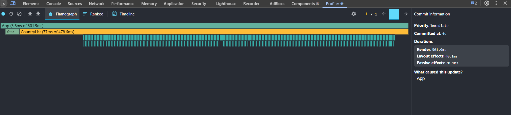
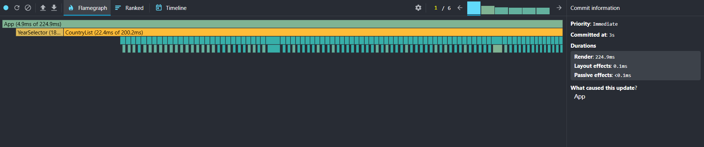
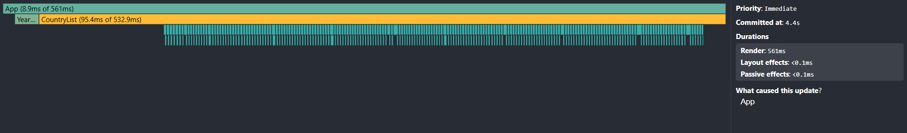
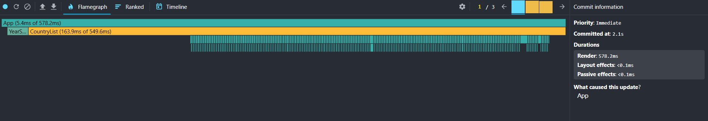

# Performance Optimization Report

## 1. Baseline Measurements (Unoptimized)

### Interaction A: Sort countries

- **Commit duration**: ~4 s
- **Render duration**: 501.9 ms
- **Screenshot**: 

### Interaction B: Search countries

- **Commit duration**: ~3 s
- **Render duration**: 224.9 ms
- **Screenshot**: 

### Interaction C: Change year

- **Commit duration**: ~4.4 s
- **Render duration**: 561 ms
- **Screenshot**: 

### Interaction D: Toggle column

- **Commit duration**: ~2.1 s
- **Render duration**: 578.2 ms
- **Screenshot**: 

---

## 2. Optimization Changes

Describe here **what** you optimized and **why**.  
Example:

- Added `useMemo` for filtered and sorted country list
- Wrapped `CountryRow` component with `React.memo`
- Used `useCallback` for event handlers (`handleSort`, `handleSearch`, etc.)
- Added proper `key` props to all list items
- Implemented virtualization using `react-window` for the countries table

---

## 3. Optimized Measurements

### Interaction A: Sort countries

- **Commit duration**: \_\_\_ ms
- **Render duration**: \_\_\_ ms
- **Screenshot**: 

### Interaction B: Search countries

- **Commit duration**: \_\_\_ ms
- **Render duration**: \_\_\_ ms
- **Screenshot**: 

### Interaction C: Change year

- **Commit duration**: \_\_\_ ms
- **Render duration**: \_\_\_ ms
- **Screenshot**: 

### Interaction D: Toggle column

- **Commit duration**: \_\_\_ ms
- **Render duration**: \_\_\_ ms
- **Screenshot**: 

---

## 4. Summary of Improvements

| Interaction      | Baseline (ms) | Optimized (ms) | Improvement |
| ---------------- | ------------- | -------------- | ----------- |
| Sort countries   |               |                |             |
| Search countries |               |                |             |
| Change year      |               |                |             |
| Toggle column    |               |                |             |
| **Average**      | \*\* \*\*     | \*\* \*\*      | ** %**      |
