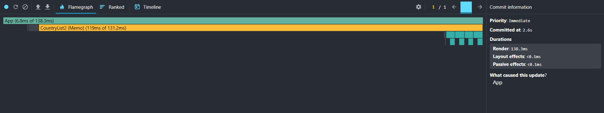
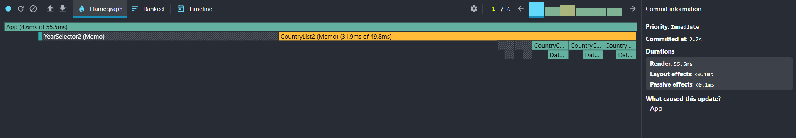
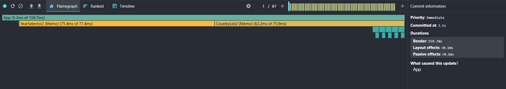
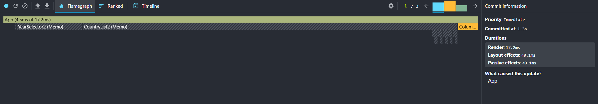

# Performance Optimization Report

## 1. Baseline Measurements (Unoptimized)

### Interaction A: Sort countries

- **Commit duration**: ~4 s
- **Render duration**: 501.9 ms
- **Screenshot**: 

### Interaction B: Search countries

- **Commit duration**: ~3 s
- **Render duration**: 224.9 ms
- **Screenshot**: 

### Interaction C: Change year

- **Commit duration**: ~4.4 s
- **Render duration**: 561 ms
- **Screenshot**: 

### Interaction D: Toggle column

- **Commit duration**: ~2.1 s
- **Render duration**: 578.2 ms
- **Screenshot**: 

---

## 2. Optimization Changes

- Added `useMemo` for available years and columns, the filtered and sorted country list, card year metrics, and table year data so these computed values are recalculated only when their inputs change.
- Used `useCallback` for search, year, sorting, column, and modal event handlers so memoized child components receive stable callback references.
- Wrapped `CountryList`, `CountryCard`, `SearchBar`, `YearSelector`, and `ColumnModal` with `React.memo` to prevent re-renders when their props have not changed.
- Replaced array-index keys with stable data keys: `country.id` for country cards and the column name for table rows. Existing year and modal lists already use stable value keys.
- Virtualized the country list with a fixed-height scroll viewport, calculated row positions, and two-row overscan so only visible country cards and nearby rows are mounted(custom virtualization without built-in libraries).

---

## 3. Optimized Measurements

### Interaction A: Sort countries

- **Commit duration**: ~2.6 ms
- **Render duration**: 138.3 ms
- **Screenshot**: 

### Interaction B: Search countries

- **Commit duration**: ~2.2 ms
- **Render duration**: 55.5 ms
- **Screenshot**: 

### Interaction C: Change year

- **Commit duration**: ~3.1 ms
- **Render duration**: 159.7 ms
- **Screenshot**: 

### Interaction D: Toggle column

- **Commit duration**: ~1.3 ms
- **Render duration**: 17.2 ms
- **Screenshot**: 

---

## 4. Summary of Improvements

| Interaction      | Baseline (ms) | Optimized (ms) | Improvement |
| ---------------- | ------------- | -------------- | ----------- |
| Sort countries   | 501.9         | 138.3          | **72.4%**   |
| Search countries | 224.9         | 55.5           | **75.3%**   |
| Change year      | 561           | 159.7          | **71.5%**   |
| Toggle column    | 578.2         | 17.2           | **97.0%**   |
| **Average**      | **466.5**     | **92.7**       | **80.1%**   |
